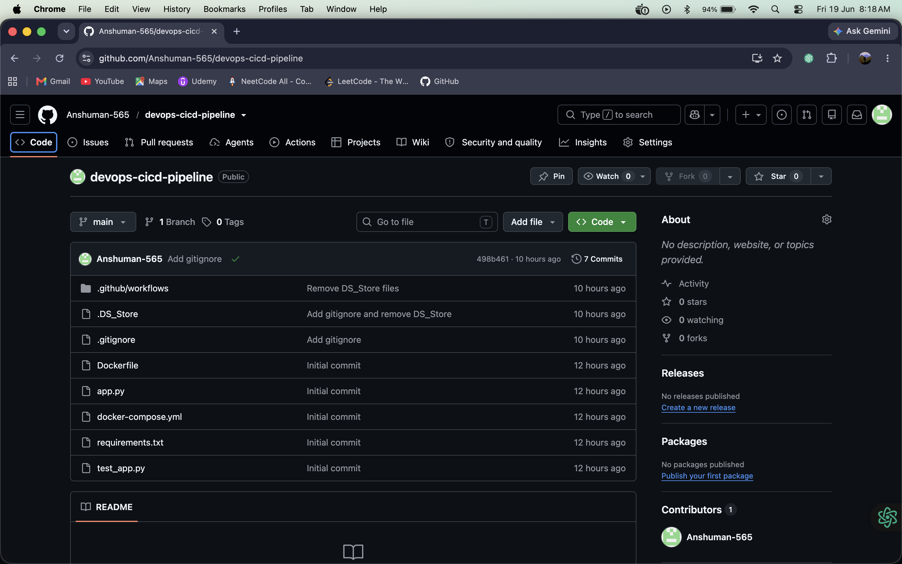
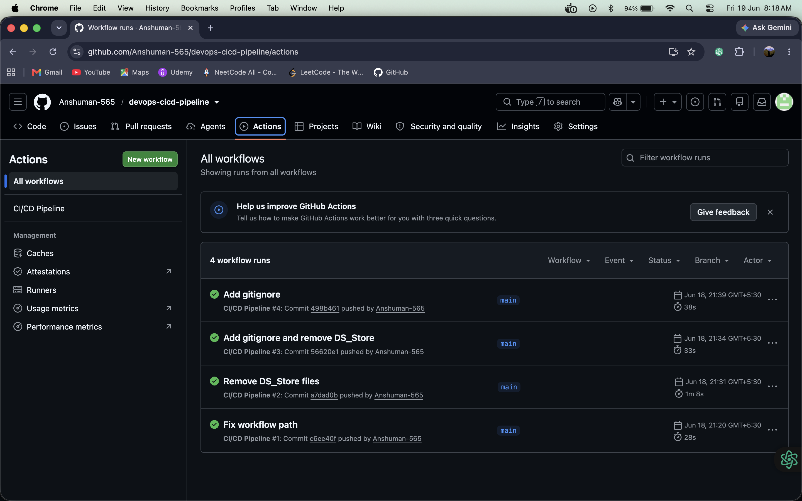
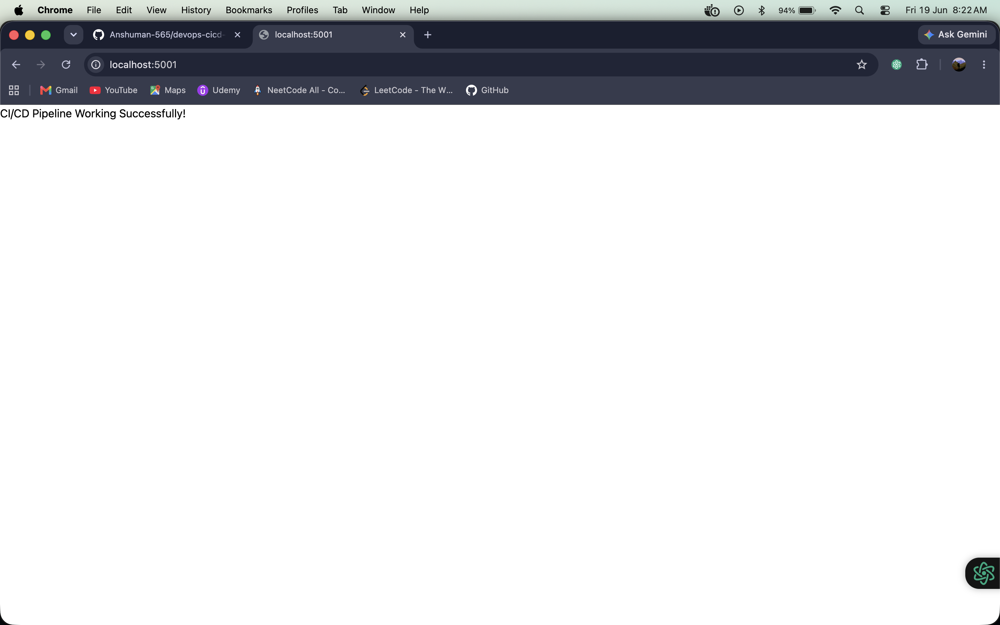
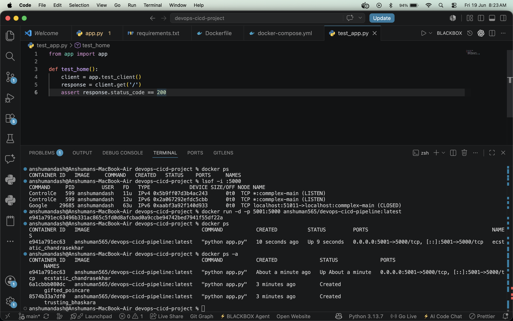

# CI/CD Pipeline with GitHub Actions and Docker

## Project Overview

This project demonstrates a Continuous Integration and Continuous Deployment
pipeline using GitHub Actions and Docker.

It contains a simple Flask web application that is tested with Pytest,
containerized with Docker, and published to Docker Hub whenever changes are
pushed to the `main` branch.

## Technologies Used

* Python
* Flask
* Pytest
* Docker
* Docker Compose
* Docker Hub
* GitHub Actions
* Git and GitHub

## Project Structure

```text
devops-cicd-project/
├── .github/
│   └── workflows/
│       └── ci-cd.yml
├── assets/
│   ├── docker-container-running.png
│   ├── flask-app-running.png
│   ├── github-actions-runs.png
│   └── github-repository.png
├── .gitignore
├── app.py
├── docker-compose.yml
├── Dockerfile
├── README.md
├── requirements.txt
└── test_app.py
```

## Control Flow

```text
Developer pushes code to main
        |
        v
GitHub Actions starts CI/CD Pipeline
        |
        v
Checkout repository source code
        |
        v
Set up Python 3.11
        |
        v
Install dependencies from requirements.txt
        |
        v
Run Pytest test suite
        |
        v
Login to Docker Hub with repository secrets
        |
        v
Build Docker image from Dockerfile
        |
        v
Push image to Docker Hub
        |
        v
Run container locally or on a deployment host
```

## Application Flow

```text
Browser request to /
        |
        v
Flask app receives request in app.py
        |
        v
home() route returns success message
        |
        v
Browser displays: CI/CD Pipeline Working Successfully!
```

## Screenshots

### GitHub Repository



### GitHub Actions Runs



### Flask App Running



### Docker Container Running



## Setup Instructions

### Clone Repository

```bash
git clone https://github.com/Anshuman-565/devops-cicd-pipeline.git
cd devops-cicd-pipeline
```

### Install Dependencies

```bash
pip install -r requirements.txt
```

### Run Application

```bash
python app.py
```

Open:

```text
http://localhost:5000
```

### Run Tests

```bash
pytest
```

## Docker Commands

### Build Image

```bash
docker build -t devops-cicd-pipeline .
```

### Run Container

```bash
docker run -d -p 5000:5000 devops-cicd-pipeline
```

### Run with Docker Compose

```bash
docker compose up --build
```

## CI/CD Workflow

The workflow file is located at `.github/workflows/ci-cd.yml`.

The pipeline runs on every push to the `main` branch and performs these steps:

1. Checkout source code
2. Set up Python 3.11
3. Install Python dependencies
4. Execute unit tests with Pytest
5. Login to Docker Hub
6. Build the Docker image
7. Push the Docker image to Docker Hub

The workflow expects these GitHub repository secrets:

* `DOCKER_USERNAME`
* `DOCKER_PASSWORD`

## Docker Hub Repository

Docker image:

```text
anshuman565/devops-cicd-pipeline:latest
```

## Author

Anshuman Dash
